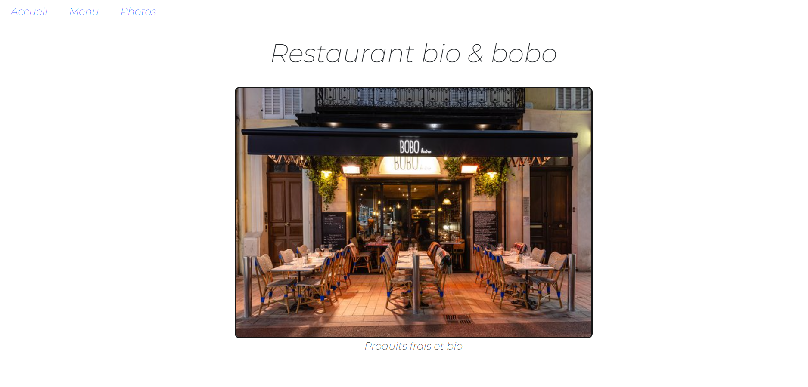
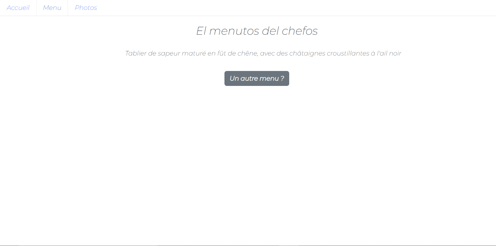
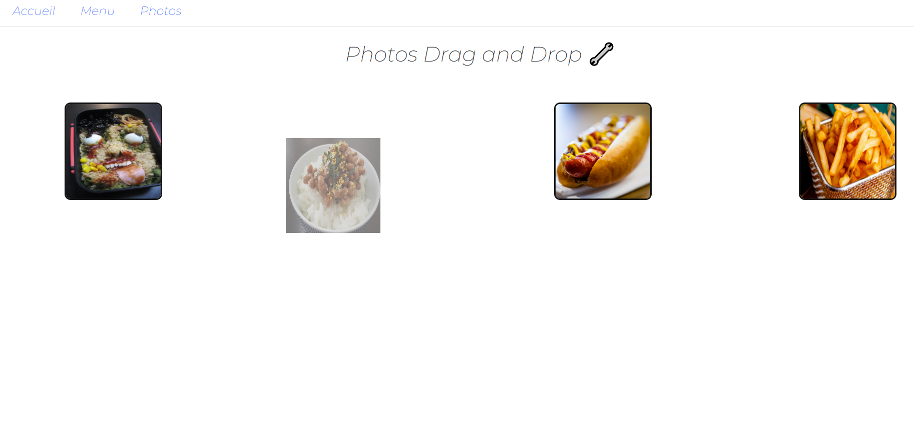

## Petit exercice Javascript

- DOM et EventListeners    

Page principal qui change en fonction de l'onglet séléctionné

    

Page des menu avec un bouton qui permet de générer un nouveau menu 

    

Page des photos, qu'on peut déplacer (drag and drop)

